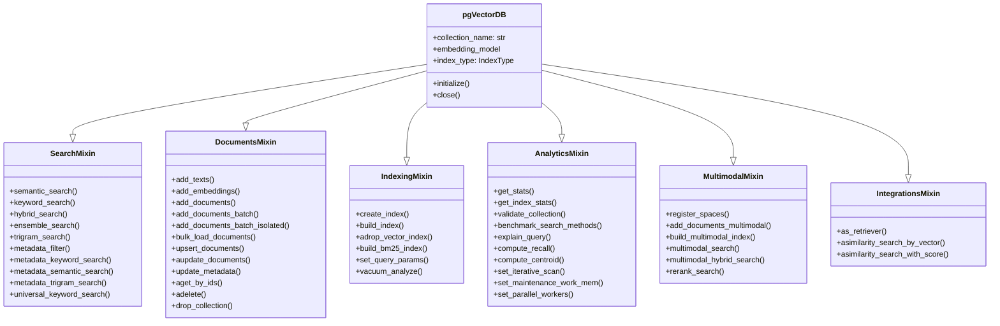

# Core Concepts: Architectural Deep Dive

pgVectorDB is an enterprise-grade RAG orchestrator built on top of `langchain_postgres`. This guide covers the internal architecture, mixin system, and the key PostgreSQL mechanisms that power it.

---

## 1. The LangChain Foundation

pgVectorDB is built on the `langchain_postgres.v2` ecosystem:

1. **`PGEngine`** — Manages async SQLAlchemy connection pools via `asyncpg`
2. **`PGVectorStore`** — Executes document chunking, vectorized insertions, and retrieval

!!! note
    Documents stored in pgVectorDB are 100% interoperable with LangChain retrievers, RAG chains, and agents. Use `db.as_retriever()` to plug directly into any LCEL chain.

---

## 2. The Mixin Architecture

`pgVectorDB` is composed by inheriting from 6 specialized mixin classes. Each mixin owns a distinct concern:



This composable design keeps each concern isolated and testable. You can grep a single mixin file to understand an entire subsystem.

---

## 3. Distance Metrics

pgVectorDB supports 6 distance metrics through pgvector operators:

| Metric | `DistanceMetric` | SQL Operator | Best For |
|--------|-----------------|--------------|---------|
| Cosine | `COSINE` | `<=>` | Normalized embeddings (most common) |
| Euclidean | `L2` | `<->` | When magnitude matters |
| Inner Product | `INNER_PRODUCT` | `<#>` | Dot product similarity |
| Manhattan | `L1` | `<+>` | Sparse features, grid data |
| Hamming | `HAMMING` | `<~>` | Binary embeddings |
| Jaccard | `JACCARD` | `<%>` | Set similarity |

```python
from pgvectordb import DistanceMetric

await db.create_index(metric=DistanceMetric.COSINE)
```

!!! tip
    If you're using `text-embedding-3-*` (OpenAI) or `all-MiniLM-L6-v2` (HuggingFace), these models produce normalized vectors — **Cosine** distance is the right choice.

---

## 4. Vector Precision

Lower precision reduces storage size but may affect accuracy:

| `VectorPrecision` | Storage | Max Dimensions | Use Case |
|-------------------|---------|----------------|---------|
| `FLOAT32` | 4 bytes/dim | 2,000 | Default — maximum accuracy |
| `FLOAT16` | 2 bytes/dim | 4,000 | Storage-constrained deployments |
| `BINARY` | 1 bit/dim | 64,000 | Binary embeddings, Hamming distance |

```python
from pgvectordb import VectorPrecision
# FLOAT16 / BINARY support via halfvec — coming in future release
```

---

## 5. Iterative Scan Modes (pgvector 0.8+)

When using metadata filters with vector search, the ANN index may return fewer than `k` results because many candidates are filtered out. Iterative scan solves this by continuing graph traversal until `k` matching documents are found.

| `IterativeScanMode` | Behavior |
|---------------------|----------|
| `OFF` | Standard index scan (default) |
| `STRICT_ORDER` | Guarantees exact distance ordering — slower but precise |
| `RELAXED_ORDER` | Better recall, slight ordering variance — recommended for filtered search |

```python
from pgvectordb import IterativeScanMode

# Note: set_iterative_scan is synchronous — no await needed
db.set_iterative_scan(
    mode=IterativeScanMode.RELAXED_ORDER,
    max_scan_tuples=50000
)
```

---

## 6. Extension Manager & Graceful Degradation

The `ExtensionManager` detects which PostgreSQL extensions are installed at `initialize()` time and adjusts behavior automatically:

!!! warning "Required Extensions"
    - `vector` (pgvector) — Required for **all** index types and vector operations
    - `pg_trgm` — Required for trigram fuzzy matching

!!! note "Optional Extensions"
    - `vectorscale` — Required for DiskANN index and label filtering
    - `pg_textsearch` — Enables BM25 ranking; without it, pgVectorDB gracefully degrades to FTS (`ts_rank`)

When `pg_textsearch` is missing, `keyword_search(search_type=KeywordSearchType.BM25)` automatically falls back to `ts_rank` FTS scoring — no code change needed.

---

## 7. The `QueryResult` Type

All search methods return `List[QueryResult]`, a `TypedDict` with these fields:

```python
from pgvectordb import QueryResult

results: list[QueryResult] = await db.semantic_search("query", k=5)

for r in results:
    print(r["id"])        # str  — internal langchain_id UUID
    print(r["content"])   # str  — raw text of the document
    print(r["metadata"])  # dict — JSONB metadata dict
    print(r["score"])     # float — relevance score (direction varies by method)
```

!!! warning
    `QueryResult` is a `TypedDict` — **not** a class. Use `r["content"]` dict-style access, not `r.content` attribute access.

---

## 8. Security Design

pgVectorDB is designed for production use:

- **Schema name validation** — `schema_name` is validated against `^[a-zA-Z0-9_]+$` before being interpolated into any SQL. This prevents SQL injection via schema names.
- **Parameterized queries** — All user data (embeddings, content, metadata, filter values) is passed as SQLAlchemy bound parameters, never interpolated into SQL strings.
- **Query param allowlist** — `set_query_params()` validates all keys against `VALID_QUERY_PARAMS` allowlist before executing `SET` statements.
- **Memory value validation** — `set_maintenance_work_mem()` validates input against `^\d+\s*(kB|MB|GB|TB)?$` regex to prevent injection.
