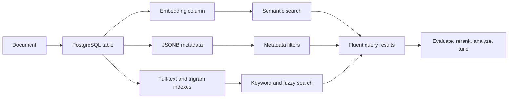

# Core Concepts

pgVectorDB is a PostgreSQL-backed retrieval library. It keeps documents, metadata, embeddings, filters, indexes, evaluation, and diagnostics close to the data instead of splitting retrieval across a separate vector service.

## Mental Model



The core loop is simple:

1. Create a `pgVectorDB` collection.
2. Add LangChain `Document` objects.
3. Build the vector and scalar indexes that match your workload.
4. Query with `db.query(...)`.
5. Measure quality and latency before tuning.

## Collections, Documents, and Metadata

A collection maps to a PostgreSQL table. Each row stores the document text, a generated `langchain_id`, JSONB metadata, and at least one embedding.

```python
from langchain_core.documents import Document

documents = [
    Document(
        page_content="Hybrid search combines semantic and keyword signals.",
        metadata={"topic": "search", "year": 2026, "tier": "core"},
    )
]

ids = await db.add_documents(documents)
```

Metadata is first-class. You use it for tenant isolation, permissions, categories, dates, product attributes, quality tiers, and any structured signal that should affect retrieval.

## The Fluent Query API

`db.query(...)` is the recommended entry point for new code. It returns a lazy query builder, so no database work happens until you call `to_list()`, `to_pandas()`, `to_arrow()`, or `analyze_plan()`.

```python
results = await (
    db.query("production RAG diagnostics")
    .hybrid()
    .where({"topic": {"$in": ["search", "optimization"]}})
    .weights(semantic=0.7, keyword=0.3)
    .limit(10)
    .to_list()
)
```

Use these mode selectors for the main retrieval families:

| Mode | Best for | Example |
| --- | --- | --- |
| `.semantic()` | Meaning-based vector similarity. | `db.query("refund policy").semantic()` |
| `.keyword()` | Exact terms, compliance language, names, IDs, and BM25. | `db.query("SOC 2 retention").keyword().bm25()` |
| `.hybrid()` | Queries that need meaning plus exact wording. | `db.query("database backup policy").hybrid().rrf()` |
| `.trigram()` | Typo-tolerant matching. | `db.query("vectro serch").trigram().threshold(0.2)` |

Legacy methods such as `semantic_search()`, `keyword_search()`, `hybrid_search()`, and `trigram_search()` still exist for compatibility and advanced use. The fluent API is the path used throughout these docs.

## Filters and Scalar Indexes

Filters use MongoDB-style dictionaries and compile to PostgreSQL JSONB predicates.

```python
results = await (
    db.query("wireless headphones")
    .semantic()
    .where({
        "category": "electronics",
        "price": {"$between": [50, 200]},
        "rating": {"$gte": 4.0},
    })
    .limit(10)
    .to_list()
)
```

For large collections, add scalar indexes to the fields you filter often:

```python
await db.create_scalar_index("price", index_type="btree")
await db.create_scalar_index("category", index_type="bitmap")
```

Use B-tree indexes for ranges and high-cardinality equality. Use bitmap/GIN-style indexes for low-cardinality categories and membership-style filters.

## Indexes and Search Performance

pgVectorDB supports the PostgreSQL vector index families you need as data grows.

| Index | Best fit | Notes |
| --- | --- | --- |
| HNSW | Default for most collections and strong recall. | Tune query recall with `.ef(n)`. |
| IVFFlat | Large collections with predictable memory use. | Requires existing data; tune with `.nprobes(n)`. |
| DiskANN | Very large datasets where memory matters. | Requires `vectorscale`; supports label filtering. |

Build the configured vector index with `build_index()`:

```python
from pgvectordb import DistanceMetric

await db.build_index(metric=DistanceMetric.COSINE, m=16, ef_construction=64)
```

Optimization is a measurement loop: build an index, run representative queries, inspect plans, compute recall, then adjust query parameters or index settings.

## Multimodal Spaces and Recency

Standard vector search embeds one text field. pgVectorDB can also register multiple vector spaces per document and fuse their scores.

| Space | Signal | Use case |
| --- | --- | --- |
| `TextSpace` | Text embeddings. | Description, title, body text. |
| `NumberSpace` | Numeric preference. | Price, rating, mileage, square footage. |
| `CategorySpace` | Categorical similarity. | City, product type, department. |
| `RecencySpace` | Exponential time decay. | Fresh listings, recent tickets, new docs, latest news. |

`RecencySpace` is useful when freshness should influence ranking without a separate reranking pass:

```python
from pgvectordb.spaces import RecencySpace, TimeUnit

freshness = RecencySpace(
    name="freshness",
    field="published_at",
    time_unit=TimeUnit.DAY,
    period_value=7,
)
```

## Evaluation Before Tuning

RAG quality should be measured, not guessed. `RAGEvaluator` computes retrieval metrics across a test set so you can compare search modes, weights, indexes, rerankers, and `k` values.

| Metric | Use it when you care about... |
| --- | --- |
| Hit Rate | Whether at least one relevant result appears. |
| Precision / Recall / F1 | Relevance density and coverage. |
| MRR | How high the first useful result appears. |
| NDCG | Overall ranked quality when multiple documents are relevant. |
| MAP | Rank-aware average precision across queries. |

## SQL Analysis and Diagnostics

Use analysis tools when latency, recall, or index usage is unclear.

```python
plan = db.query("filtered vector search").semantic().where({"topic": "search"}).explain_plan()

metrics = await (
    db.query("filtered vector search")
    .semantic()
    .where({"topic": "search"})
    .analyze_plan()
)
```

For production checks, use collection validation, benchmark methods, recall computation, index stats, table stats, and vacuum/analyze workflows from the diagnostics guide.

## PostgreSQL Extensions

| Extension | Required | Enables |
| --- | --- | --- |
| `vector` | Yes | Vector columns, distances, HNSW, IVFFlat. |
| `pg_trgm` | Yes | Trigram fuzzy search. |
| `vectorscale` | Required for DiskANN | DiskANN and label-filtered vector search. |
| `pg_textsearch` | Required for BM25 | BM25 ranking. Use PostgreSQL FTS when it is unavailable. |

## Where to Go Next

| Topic | Guide |
| --- | --- |
| First working collection | [Quickstart](quickstart.md) |
| Fluent search modes | [Search & Retrieval](../user_guide/search_and_retrieval.md) |
| Metadata filters and scalar indexes | [Metadata Filtering](../user_guide/filtering.md) |
| Recency and multimodal ranking | [Multimodal Search](../user_guide/multimodal_search.md) |
| Built-in retrieval metrics | [Metrics & Evaluation](../user_guide/metrics_and_evaluation.md) |
| Query analysis and health checks | [Analytics & Diagnostics](../user_guide/analytics_and_diagnostics.md) |
| Index and storage tuning | [Indexing & Performance](../advanced/indexing.md) |