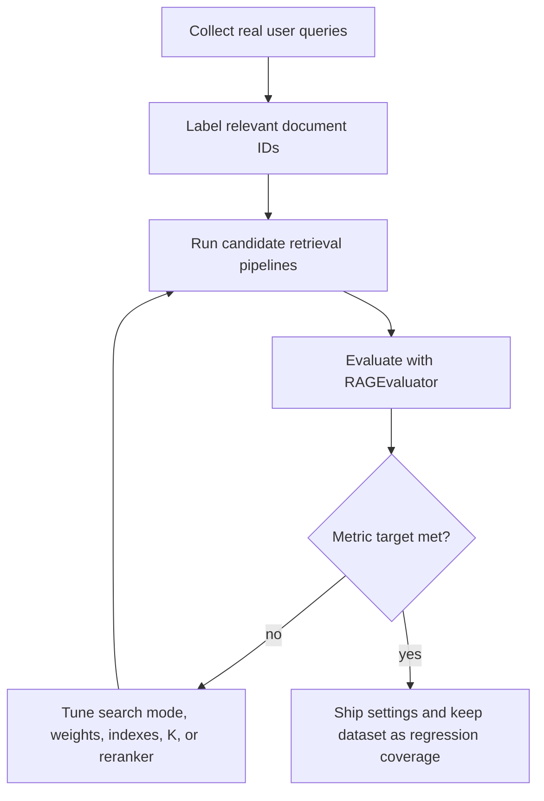

# Metrics & Evaluation

pgVectorDB includes built-in retrieval metrics so you can prove whether a search change helped before shipping it. Use `RAGEvaluator` to score retrieved document IDs against ground truth, and use `KValueAnalysis` to decide how many documents to send downstream to an LLM.

## What the Evaluator Measures

| Metric | Meaning | Use it to answer |
| --- | --- | --- |
| Precision@K | Relevant documents in top K divided by K. | How much irrelevant context am I sending? |
| Recall@K | Relevant documents found divided by total relevant documents. | Am I missing important context? |
| F1@K | Harmonic mean of precision and recall. | What balances quality and coverage? |
| MAP@K | Mean average precision across ranked results. | Are relevant documents consistently high in the list? |
| MRR | Reciprocal rank of the first relevant result. | How quickly does the first useful result appear? |
| NDCG@K | Position-discounted ranking quality. | Are all useful results ranked well? |
| Hit Rate@K | Fraction of queries with at least one relevant result. | Does the retriever find anything useful at all? |

## Build a Ground Truth Dataset

Ground truth is a list of queries and the document IDs that should be considered relevant.

```python
from pgvectordb import EvaluationDataset

dataset = EvaluationDataset()
dataset.add_query(
    query="How do I tune HNSW recall?",
    relevant_doc_ids=["doc_hnsw_tuning", "doc_recall_benchmark"],
    metadata={"topic": "optimization"},
)
dataset.add_query(
    query="How do scalar indexes help filters?",
    relevant_doc_ids=["doc_scalar_indexes", "doc_filtering"],
    metadata={"topic": "filtering"},
)

dataset.save("eval_dataset.json")
```

Load it later with:

```python
dataset = EvaluationDataset.load("eval_dataset.json")
```

## Evaluate Fluent Search Results

`RAGEvaluator` does not call the database for you. It evaluates the IDs your retrieval pipeline returned. This keeps it flexible: you can compare semantic, hybrid, reranked, multimodal, or external retrievers with the same metrics.

```python
from pgvectordb import RAGEvaluator


async def retrieve_ids(query: str, k: int) -> list[str]:
    rows = await (
        db.query(query)
        .hybrid()
        .weights(semantic=0.7, keyword=0.3)
        .limit(k)
        .to_list()
    )
    return [row["id"] for row in rows]


k = 5
retrieved_results = [
    await retrieve_ids(query, k=k)
    for query in dataset.queries
]

evaluator = RAGEvaluator(k=k)
result = evaluator.evaluate(
    queries=dataset.queries,
    retrieved_results=retrieved_results,
    ground_truth=dataset.ground_truth,
)

print(result.to_dict())
```

## Compare Search Strategies

Run the same dataset through multiple retrieval pipelines and compare the output.

```python
async def semantic_ids(query: str, k: int) -> list[str]:
    rows = await db.query(query).semantic().limit(k).to_list()
    return [row["id"] for row in rows]


async def hybrid_ids(query: str, k: int) -> list[str]:
    rows = await db.query(query).hybrid().rrf(k=60).limit(k).to_list()
    return [row["id"] for row in rows]


async def evaluate_pipeline(name: str, retrieve, k: int):
    retrieved = [await retrieve(query, k) for query in dataset.queries]
    metrics = RAGEvaluator(k=k).evaluate(dataset.queries, retrieved, dataset.ground_truth)
    print(name, metrics.to_dict())


await evaluate_pipeline("semantic", semantic_ids, k=5)
await evaluate_pipeline("hybrid_rrf", hybrid_ids, k=5)
```

Use this pattern to compare:

- semantic vs keyword vs hybrid search
- weighted hybrid vs RRF
- different `ef` or `nprobes` values
- filters with and without scalar indexes
- multimodal weights
- reranking backends

## K-Value Analysis

Use `KValueAnalysis` when you need the smallest `k` that still gives enough retrieval quality. This directly affects LLM latency and token cost.

```python
from pgvectordb import KValueAnalysis


retrieved_by_k = {}
for k in [1, 3, 5, 10, 20]:
    retrieved_by_k[k] = [
        await hybrid_ids(query, k=k)
        for query in dataset.queries
    ]

analyzer = KValueAnalysis()
results_by_k = analyzer.analyze(
    queries=dataset.queries,
    retrieved_results_by_k=retrieved_by_k,
    ground_truth=dataset.ground_truth,
)

recommendation = analyzer.get_recommendation()
print(recommendation)
```

Interpretation examples:

| Pattern | What it means | Next action |
| --- | --- | --- |
| Recall improves but precision drops as K grows. | You are finding more relevant docs but adding noise. | Add reranking or reduce K. |
| MRR is low while hit rate is high. | Relevant docs are present but buried. | Use hybrid search or a reranker. |
| NDCG is low for multimodal search. | Weights are likely misaligned. | Tune space weights with a validation set. |
| Recall is low for ANN but exact search is strong. | Index/query params are too aggressive. | Increase `.ef(...)`, `.nprobes(...)`, or use `compute_recall()`. |

## Single Query Debugging

Use `evaluate_single_query()` to inspect one failing query while tuning.

```python
metrics = RAGEvaluator(k=5).evaluate_single_query(
    retrieved_docs=["doc_a", "doc_b", "doc_c"],
    relevant_docs=["doc_b", "doc_d"],
)

print(metrics)
```

## Evaluation Workflow



## Practical Targets

Targets depend on your domain, but these ranges are useful starting points.

| Workload | Metric to prioritize | Why |
| --- | --- | --- |
| Customer support RAG | Hit Rate and MRR | Find at least one good answer and rank it early. |
| Legal or policy search | Recall and NDCG | Missing relevant material is expensive. |
| Product search | NDCG and precision | Ranking order affects conversion and trust. |
| Internal knowledge base | Hit Rate and F1 | Balance coverage with context quality. |
| Multimodal search | NDCG by query segment | Tune weights per product/domain need. |

## Related Tools

- Use [Analytics & Diagnostics](analytics_and_diagnostics.md) to measure latency, recall against exact search, index health, and slow queries.
- Use [Indexing & Performance](../advanced/indexing.md) to tune HNSW, IVFFlat, DiskANN, scalar indexes, and query parameters.
- Use [Reranking](reranking.md) when Hit Rate is acceptable but MRR or NDCG is weak.
- See [examples/05_rag_evaluation.ipynb](https://github.com/jainilpanchal2000/pgVectorDB/blob/main/examples/05_rag_evaluation.ipynb) for a notebook workflow.